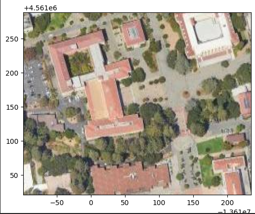

# CSGY6613-Project
Chase Huang

0: Environment setup
--
### 0.1 QGIS Installation
- Download QGIS from [this site](https://qgis.org/en/site/) 
- Click the downloaded `.msi` file and follow the instruction to install QGIS
- When the installation is down, we will have a folder containing such file
	![[Pasted image 20240412180819.png|500]]
- Open `QGIS Desktop 3.36.1`
	- Starting
		
	- The main page
		
## 0.2 Docker container setup
- Download `.devcontainer`, `requirements`  and `docker/Dockerfile.pytorch` from [this repo]( https://github.com/pantelis/artificial-intelligence)
- Set the correct path to the dockerfile in`.devcontainer/devcontainer.json`
- `Ctrl+Shift+P` open control pannel and seaech for `Dev Containers` and start to build

1: SAM implementation for satellite imagery
--
The implementation is showcased in `SAM_for_satellite_imagery.ipynb`
### 1.1 Environment 
- a few packages need to change version for the `samgeo` to work
```	
# change opencv version to 4.8
!pip uninstall opencv-python opencv-contrib-python
!pip install opencv-python==4.8.0.74
!pip install opencv-contrib-python==4.8.0.74

# Install xarray
!pip install xarray

## pyarrow and numpy
!pip install pyarrow==12.0.0
!pip install numpy==1.23
```
- Instal `segment-geospatial`

### 1.2 Load the map
- Load the satellite map and draw area of interst
	
- Download the image of the iou drawn as ` .tif `and show
	
- Overlay the downloaded image as a new layer of the map

### 1.3 SAM segmentation  for satellite_imagery
- Load the pretrained SAM model