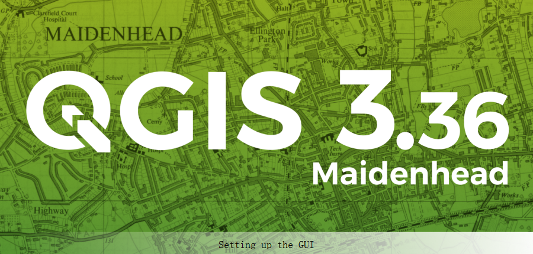
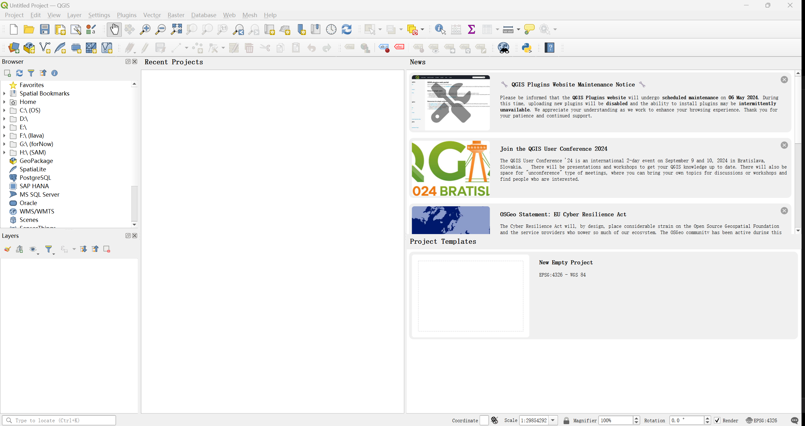
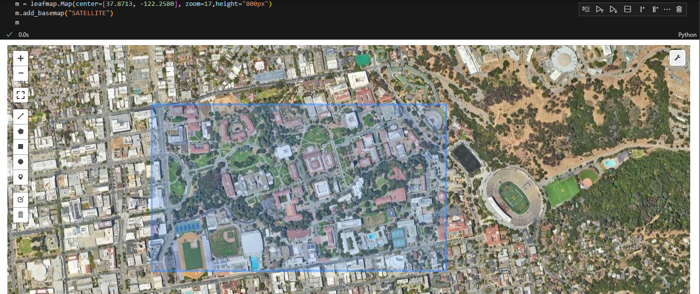
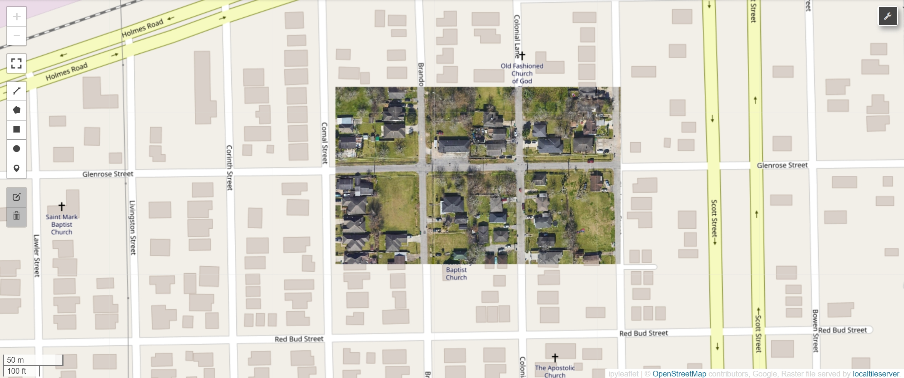
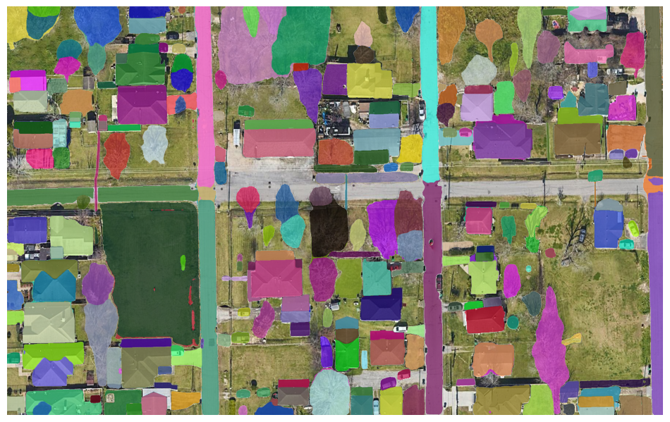
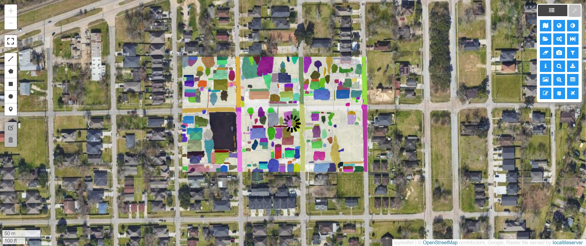
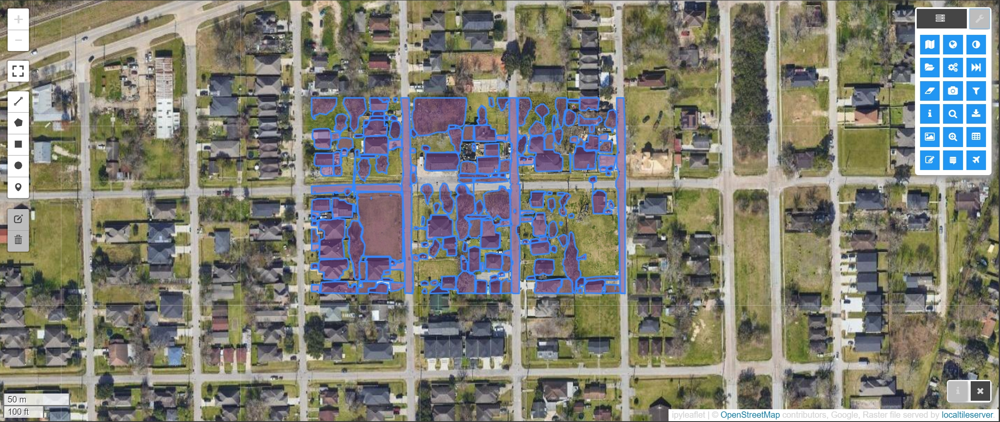

0: Environment setup
--
### 0.1 QGIS Installation
- Download QGIS from [this site](https://qgis.org/en/site/) 
- Click the downloaded `.msi` file and follow the instruction to install QGIS
- When the installation is down, we will have a folder containing such file
- Open `QGIS Desktop 3.36.1`
	- Starting
		
	- The main page
		
## 0.2 Docker container setup
- Download `.devcontainer`, `requirements`  and `docker/Dockerfile.pytorch` from [this repo]( https://github.com/pantelis/artificial-intelligence)
- Set the correct path to the dockerfile in`.devcontainer/devcontainer.json`
- `Ctrl+Shift+P` open control pannel and seaech for `Dev Containers` and start to build

1: SAM implementation for satellite imagery
--
The implementation is showcased in `SAM_for_satellite_imagery.ipynb`
### 1.1 Environment 
- a few packages need to change version for the `samgeo` to work
```	
# change opencv version to 4.8
!pip uninstall opencv-python opencv-contrib-python
!pip install opencv-python==4.8.0.74
!pip install opencv-contrib-python==4.8.0.74

# Install xarray
!pip install xarray

## pyarrow and numpy
!pip install pyarrow==12.0.0
!pip install numpy==1.23
```
- Instal `segment-geospatial`

### 1.2 Load the map
- Create the interactive map and overlay the satellite baseamap
- Select area of interst
	
- Download the image of the iou drawn as ` .tif `and show
	
- Overlay the downloaded image as a new layer of the map
	
### 1.3 SAM segmentation  for satellite imagery
- Load the pretrained SAM model via  `SamGeo(model_type, checkpoint=ckpt,sam_kwargs)`
- Perform SAM segmentation using `sam.generate(image,output=mask)`
- Display and save binary mask `mask.tiff`using `sam.show_masks(cmap="binary_r")`
	
- Display and save annotation image `sam.show_anns(axis="off",alpha=0.7,output="annotation.tif")`
	
- Display the comparision of satellite image and annotation image using `leafmap.image_comparison("satellite.tif", "annotation.tif", label1="Satellite", label2="Image Segmentation")`
	
- Overlay the segmentation result on the interactive map via `m.add_raster("annotation.tif",alpha=0.5,layer_name="Mask")`
	
- Convert the mask to verctor data format e.g., 
	- Geo package `segment.gpkg` via `sam.tiff_to_gpkg(mask, vector, simplify_tolerance=None)`
	- Shapefile `segment.shp` via `sam.tiff_to_vector(mask, shapefile)`
	- Add vector on the interactive map via `m.add_vector(vector, layer_name="Vector", style=style)`
	